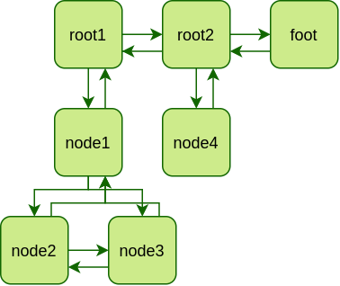

# Containers

# What is it
Container library

# Tree
Basically, k-tree looks like this:



You can add as many hodes and their children as you want and then iterate through them depth-wise or breadth-wise.

## Examples

```c++
k_tree::tree<int> t; //create empty tree
auto it = t.set_root(0); //set it's root (obviously) and save depth-first iterator to it
t.insert_left(it, 1); 
it = t.insert_right(it, 2);
t.append_child(it, 3);
t.prepend_child(it, 4);
/* this will create following tree:
   1-0-2
      / \
      4-3
*/
```

There are already a good examples in [tests](tests) directory.

If you used this library in your code and want it to appear in this list, open an issue.

## Contributors
Just me yet
